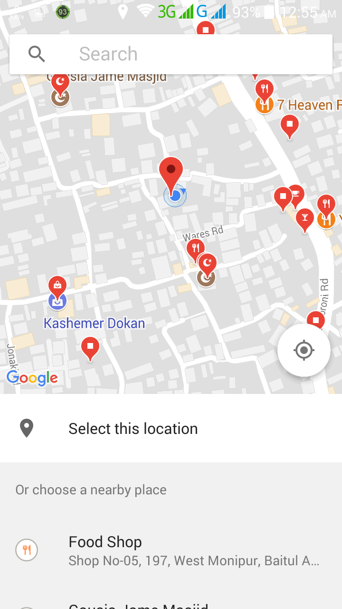

# GoogleMapsandPlaces
## Location based android application project. 
## Feature:
  1. Show my current location
  2. Search location and auto-suggestion
  3. Display more information about places with a single click
  4. Find nearby flaces in map

## screenshot:
---
1. Main Screen with my current location.
---

---
2. Search and Auto suggestion
---

---
3. Details information about place
---

---
4. Details nearby places
---

---
5. Nearby places
---

---
6. Nearby Details
---

